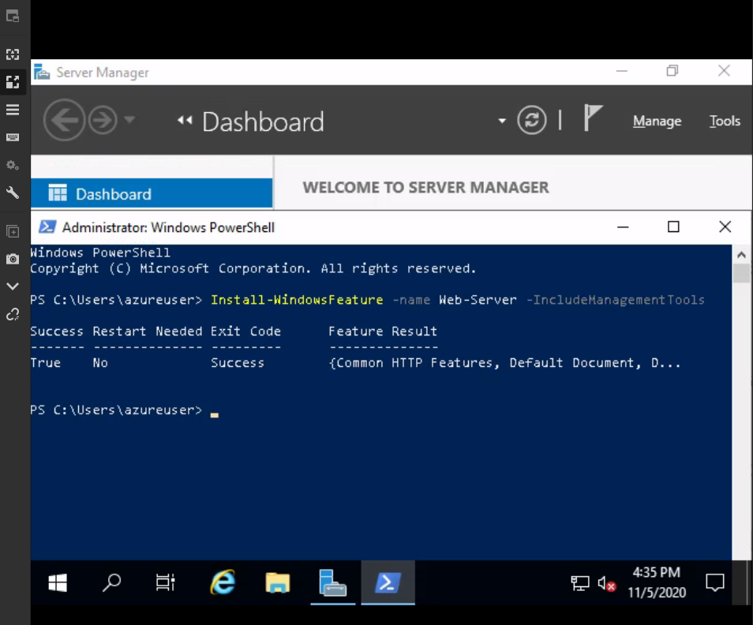

# My Journey into Cloud!

## Introduction

✍️ After an absured amount of reading and courses, I decided it is time to break out of my comfort zone and do something new. I recently joined in the #100DaysOfCloud community and after lurking for a few days joined in some conversations and decided to get in gear. After all the studying, I sat down and decided the path I wanted to go. I recently aquired my Security+ certification and looking into Cloud Security, it looked perfect. So as of right now I have my next certification path to hopefully secure my new career...

>-   AZ-900 Fundamentals
>-   AZ-104 Administrator
>-   AZ-500 Security

This is the path I have laid in front of myself. I was lucky enough to join the free Microsoft Digital Training for AZ-900 and currently waiting for my free exam voucher and get it scheduled! This led me to where I am now, I was pointed in the direction of the Microsoft Learn Github (https://github.com/MicrosoftLearning). This is where I start my #100DaysOfCloud starting with the AZ-900 Fundamentals projects! And today, I decided to jump right in and do the first one just to get the feel of it! 

I am very excited to jump in on this. Just learning Azure and playing around with these tools has shown me a fun new world ahead. Day 1 is laying the first brick to the top! 

#### HIGH-HO SILVER AWAY!

Enjoy!

Today, I started from the first Activity in AZ-900, created a virtual machine in the portal and install the web server role then test.

## Prerequisite

✍️ Ability to move around the Azure portal and understand subscriptions/resource groups. Ability to RDP into the new machine.

## Use Case


- ✍️ This could be considered something required with any position in a Cloud Career. Something simple to understand and get the grasp of how things work.

## Cloud Research

- ✍️ After Skimming through this project, I remembered that this machine had no RDP client....and this is my Linux Host Laptop. I had to find some research on a good RDP client in order to utilize the full experience. Found quite a few and settled on Remmina. Was simple and easy to use! 

Once that was installed and ready, was time to dive in.

## Try yourself

✍️ This was a very easy and well documented project. Props to the Microsoft learn Github for this!

### Step 1 — Logging into my portal and locating the Virtual Machines Service.


- Once jumping into the Virtual machines service, we are given a template of the VM we are going to create. Since this VM is to be a web server, we made sure our inbound ports for HTTP(80) was open, and the RDP(3398) to remote into the machine and disable the boot diagnostics in the Monitoring section of setup since this will be just a use and scoot machine. 


### Step 2 — RDP into the machine.
- This was pretty cool to mess around with. After downloading the RDP file and using the login I seen the VM desktop as soon as I hit connect.


### Step 3 — Next up, Install the webserver using PowerShell
- This was pretty neat, I have been slowly expanding my knowledge with powershell and really starting to like it more and more since the Windows Terminal as well. So, we fired up a powershell terminal and used the command 
```
 Install-WindowsFeature -name Web-Server -IncludeManagementTools
 ```
 
 This set up the webserver for us, so we can now disconnect from the remote connection and head back to the Azure portal.



### See my fresh Webserver!
- Heading back into the portal and selecting the new VM, I aquired the public IP from the overiew and slapped it into a new tab to see my work!


## ☁️ Cloud Outcome

✍️ This was pretty neat, a simple way to do something I have really never done in this method. I have made temporary nginx servers while messing around with various hacking practice sites. It was neat to see it done from this prospective and get the feel of the flow. Going to be fun when automating a task like this using powershell or Terraform(coming for you soon Hashicorp products!!). Plenty more to do!

## Next Steps

✍️ I am really into the Microsoft learn Github, this is a fantastic set up. It was really quick to complete so I might be able to do more than one step depending on the depth and understanding I have. 

## Social Proof

✍️ Show that you shared your process on Twitter or LinkedIn

[LinkedIn](https://www.linkedin.com/posts/johnathan-outlaw_100daysofcloud-activity-6730165234750828544-o-L1)
