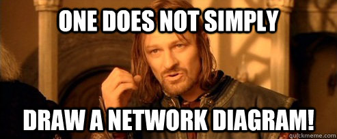

# Containing my VNet Ping Machines!!!!

## Introduction

- This was just a quick lesson but, a fun one! Was my first rodeo with starting containers and grabbed some info while creating one. Then the real fun! Made a small little vnet with a few vms which, this is something I have played around with some it still gets me giddy knowing I do not have to walk out to a hot/cold floor to install/label/configure/document/CARRY SERVERS..(for real, these guys are heavy and you cry with the thought of possibly dropping one on your foot and the $$$ your broken foot will cost!) just input and go get some coffee!!

##### Enough jibber jabber, let's do the thing!

## Prerequisite

- So, mostly like Day1 this had slim prerequisites to complete the task. Know how to find the requested services and resources within azure and implement them, then the ability to remote into the Vms.

## Use Case

- 
> - Fun diagrams will be coming soon! I am planning a python project to create network diagrams and push out images. This is just a for fun project and might expand on it as I go!

- Now, as to how this would show any workplace relation. With what I have learned through prepping for my AZ-900 and mapping out my "Where do I want to be" roadmap, these tasks would seem bare minimum expected of anyone working in a cloud environment. Ability to find these services and apply them in a best practice way (even if it was not automated, babysteps then zoom!) is something that needs to be aquired!


## The Main Event!!!


### Project 1

- This was pretty cool to finally check out. I have read about containers and how they work, that stuff is awesome! Run your applications in these and not worry so much with the platform and if X has the correct dependencies. Pure Magic!
1. So, from my 'All Services' window in my portal I had to search for 'Container Instances'. Once found, just selected add and away I went. 
2. Here, I was given Basic 'Setting:Value' directions on how this container should be set up including an image to pic. Easy enough!
3. Swapping over to the Networking tab, another 'Setting:Value' was given to set up the 'DNS name label'. Setting this up I skimed over a very important part of the instructions..<b>"replace xxxx with letters and digits such that the name is globally unique"</b>..and learned once I went to validate/create the container...sure enough, "DNS name label note available". Back to the begining and follow simple instructions!!! 

##### Like Magic....POOF!

 

- Using the NOW correct DNS name label, I was able to pop a new tab open and see this lovely screen.
 

-   Only to destroy it 2 mins later! 

### Project 2 - Vnet - Vms

- I was excited for this one! Creating a network (even if its a baby network) is still exciting. Doing this has helped me quite a bit with understanding networking and how it's implemented. Now, lets get into it!
1. Back in my trusty Portal, I am always greated with the 'Virtual Networks' icon right on the front page, easy enough. Once selected add, I was lucky enough to be given more 'Setting:Value' instructions. Making sure I understood and implemented as instructed, got the 'Deployed!' notification with no issues.


2. Now, I am instructed to created a pair of VMs to connect using my new vnet. Like before I am given 'Setting:Value' instructions to set up both VMs and to double check that I have them connected to the vnet. 
- Success on both! So now, we gather RDP information a nd log into VM1. Once I am able, I start up powershell in admin, and try to ping VM2...conclusion??

##### NO SOUP FOR YOU!


- The ping failed, this is because the ICMP ( Internet Control Message Protocol) is blocked on VM2. Lets see what we can do about that...

3. Gathering the RDP information and booting into VM2, I load up powershell in admin again and run the following command to allow ICMP.
``` 
New-NetFirewallRule –DisplayName “Allow ICMPv4-In” –Protocol ICMPv4
```
- This created a firewall rule to allow ICMP ping requests into the network. 


- Now, lets see if we can get some communication.

> Insert over dramatic visuals.

4. Now that we are back in VM1, I attempt to ping VM2 again.


- Success! Alloweth and it shall Pingeth! 

### Conclusion

- Another simple task, but fun to really do. Getting to play around with this technology is awesome, I know there are even more great things to come and cannot wait to share the experience!

## New Thinigs and Updates!

- So, I went and through down the gauntlet and scheduled my AZ-400 exam for Friday 13th. No worries, Outlaws do fine on unlucky days! Doing this project is really helping with getting ready for this, even if that is a week from today. The remaining entries for 100DaysOfCloud will start to inlclude my notes I create everyday to keep my self accountable. Ready to slay some knowledge!

##### Some Thanks

I recently made a huge change in the platform I am learning with. Talking it over with the wife (Due to the pricetag..), I signed up for the yearly [A Cloud Guru](acloudguru.com) subscription. I have a long road ahead, and I feel their playground platform will be something very useful in my hands on experience as well as the plethra of courses! I just wanted to do a Thanks to them for having somewhere I can make/break and get to where I want. 


## Next Steps

# PASS THE AZ-900 AND Beyond!!!

## Social Proof


[LinkedIn](https://www.linkedin.com/posts/johnathan-outlaw_100daysofcloud-acloudguru-activity-6730534359931117568-QQcM)
