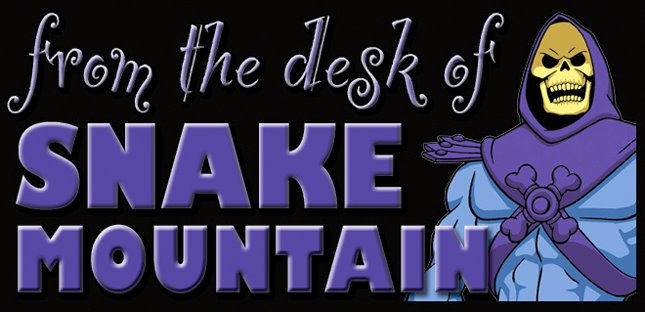

# Prep and Renewal

## Cloud Research

Today much like Day 3, I really went deep into Fundamentals, not as much hands on per usual. After looking into the new objectives for the test, I really took a note as to what is expected. So I started a new OneNote and flew back to the start. I'm glad I did, while I feel I understand the basics enough to hold confident conversations and decypher the lingo, it lit more of a spark on getting into this field and wanting more. Even groung through this material as I am planning to go right for my AZ-104, put interest into Office 365 Administration. Some pretty neat stuff there! During one of my breaks I ended up listening to a podcast from a member of the 100DaysOfClouds Community ("Real chill episode today J_cloudofthrones! Enjoy working from home life!!"). 

Reminded me of the conversation I had earlier today with a fellow member in the discord channel for AZ-900. College student looking to learn and start early on certifications with a focus on security. The enthusiasm hit me with excitement, but mistakes I made long ago when starting in IT. Not laying my foundation. I felt a bit intrusive asking about their past IT experience and such while offering my thoughts to make their life easier in the long run. Get some networking knowledge and linux to stand on, learn Administration and then build on top of that to grow the Wall of Security! Getting ahead of yourself hurts a lot when trying to get a Job in some careers, and can break the spirit. It felt good offering that tip so they would not have to backtrack like I had to do.  

While I felt slight discomfort offering that to them not wanting to sound like a know-it-all or anything, it felt good, Then remembered another podcast episode I listed to with Mike Pfeiffer and Gwyneth Peña S. (GPS), they talked about how they applied teaching their skills to their learning. Thought about that and made me want to figure something out to help others eager to learn. I have an Idea or two, so that might be something I can do to give back what I learned and make someones journey a little easier. We will see how that pans out!

Hope Everyone has an awesome week ahead of them! Friday is right around the corner and I am ready!

## Social Proof

It's in the Pudding!

[LinkedIn](https://www.linkedin.com/posts/johnathan-outlaw_100daysofcloud-activity-6731745419082158080-W59m)